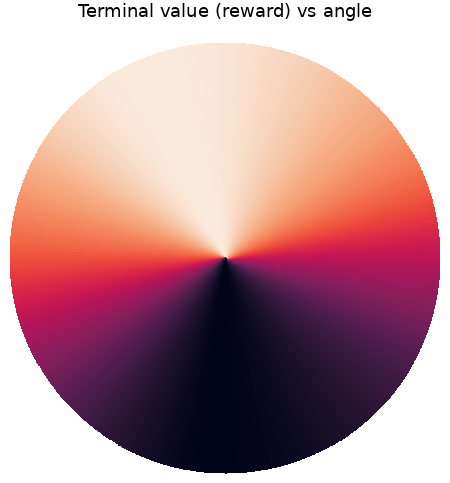
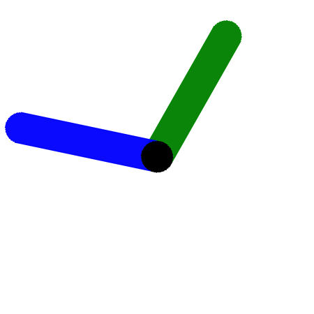

# Intention learning

Multimodal reinforcement learning from AI feedback.

  <figure style="width: 50%;">
    
    <figcaption>Reward model visualization, built from LLM-generated preferences over images of pendulum positions.</figcaption>
  </figure>
  <figure style="width: 50%;">
    
    <figcaption>Agent's behavior when trained from the LLM-generated preferences and reward model.</figcaption>
  </figure>

## Overview
Here, we use multimodal LLMs to act as a judge for determining a reward signal
in a reinforcement learning setting. We present pairs of states to the judge,
which the judge then ranks. We then train a reward model from these preferences
and use this reward model to generate a policy with standard policy gradient
methods (this is similar to RLHF, and thus could suitably named RLAIF, following
[constitutional AI](https://arxiv.org/pdf/2212.08073)). I think one fundamental
intuition for why this approach could work is that verification is easier than
implementation for many tasks. So while goal specification might be hard if we
approach the problem from a traditional RL perspective (i.e., using hand-crafted
reward signals), it actually might not be as hard as many think, particularly if
we have an aligned judge with some reasonable (but not necessarily human-level)
capability. Some (philosophical) advantages I see with this approach:
1. Allows the specification of objectives which are abstract, vague, complex, or
rely on implicit human understanding, given that the judge LLM has a robust
understanding of human concepts.
2. This is a first step towards hierarchical intention learning, whereby agents
are trained to pursue arbitrary objectives specified verbally / visually
(intentions) and then more abstract action generators are trained to *generate
intentions* which are passed to lower level agents that generate the primitive
actions (where I use the terminology from [*Angelic Semantics for High-Level
Actions*](https://people.eecs.berkeley.edu/~russell/papers/tr-hla-2007.pdf)).
This could allow the more abstract action generators to be trained to generate
higher-level intentions in a way that is agnostic of the specific primitive
action modalities that are used to execute them.  
3. This could be a promising approach to safe RL. It seems that having a capable
judge LLM supervise the training of agents would result in a lot fewer
opportunities for goal misspecification or reward hacking, as the judge is
queried at the same frequency as the actor. This is easier to see in look-ahead
model-based approaches, where the agent's planning would involve directly
querying the judge for its opinion on instrumental goals in pursuit of the
terminal. It seems that even today's LLMs can pretty accurately prune out
perverse instrumental objectives.
    - LLMs have shown to possess a robust understanding of human concepts and,
    importantly, values, but by directing LLMs in an RL setting, we're throwing
    these human value representations away and creating vulnerabilities for
    misalignment by attempting to hand-craft reward signals. However, by using
    the raw, pretrained, LLM as the judge for an agent, we can leverage these
    human value representations directly. In some sense, the judge LLM would be
    assigning a likelihood to each possible future that the agent takes
    conditioned on the fact that the agent has been designed to pursue the
    provided objective. Ideally, one would want to provide an objective as
    simple as "AI, please do what us humans want" without any more detail (i.e.,
    establishing a [coherent extrapolated volition
    dynamic](https://intelligence.org/files/CEV.pdf)), which ideally would just
    work because the judge LLM has built an understanding of human values.

## Implementation

#### Prompt
"In this image, there are two pendulums (green and blue) pivoting around the same
point in the middle (the black circle).  Which pendulum's endpoint (i.e., the
end opposite the pivot) is higher? Respond only with the color of the pendulum
whose endpoint is higher and surround your answer with curly braces, e.g.,
{green} or {blue}."

#### Provided image example

